<div align="center">

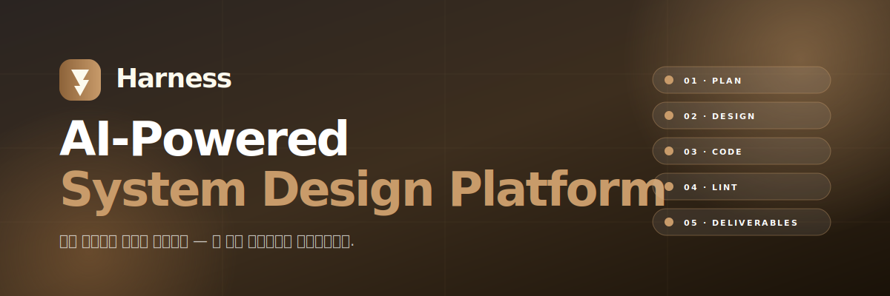

# Harness

**AI-Powered System Design Platform**

미팅 로그 한 줄에서 — 요구사항 추출 · 시스템 설계 · 코드 가이드 · 규칙 검증 · 산출물 인수인계까지.
**전 개발 생애주기를 AI로 자동화하는 5단계 파이프라인**입니다.

</div>

---

## 🌐 한 장 요약

전체 시스템을 한 장에 압축한 그림입니다. 사용자가 보는 화면(① User Journey), 데이터가 흐르는 경로(② System Architecture), Neo4j에 영속화되는 노드(③ Data Graph) — 세 관점이 어떻게 맞물리는지 보여줍니다.

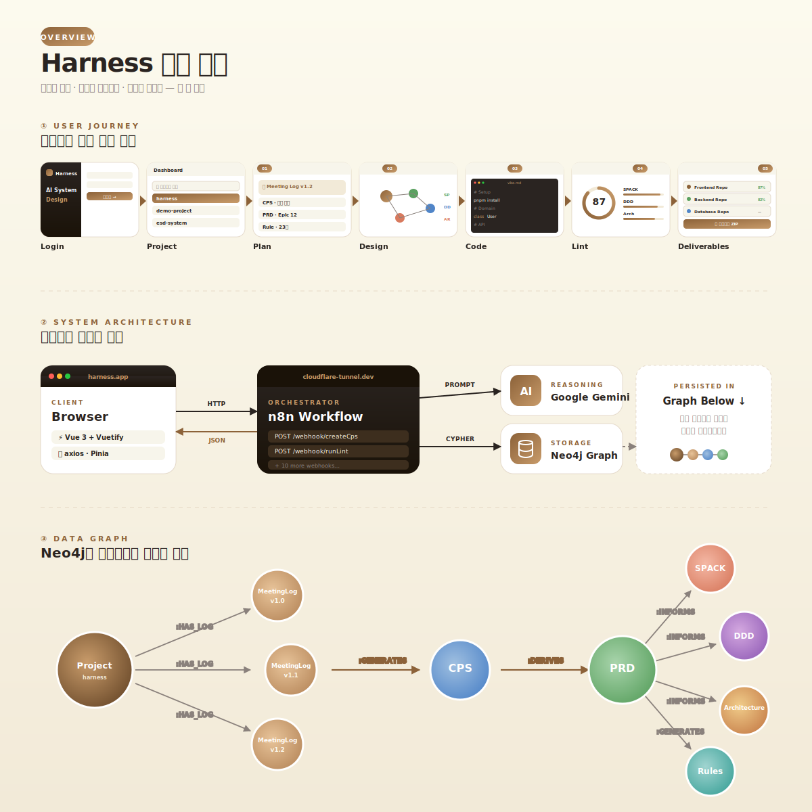

---

## 🔄 5단계 워크플로우

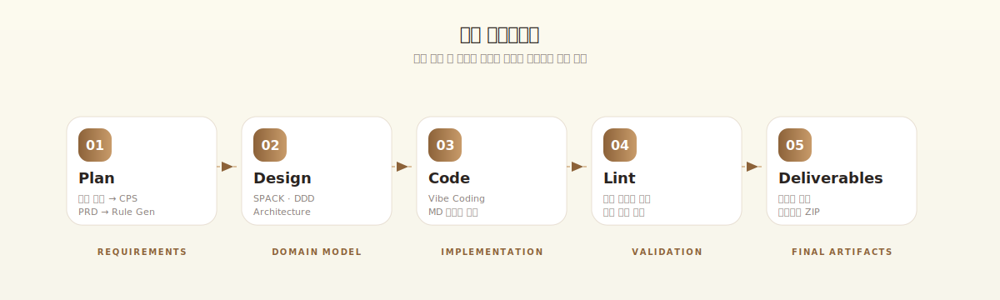

5개의 직선형 단계로 구성된 파이프라인입니다. 각 단계의 산출물이 다음 단계의 입력이 되며, 모든 산출물은 Neo4j 그래프에 영속화되어 단계 간에 연결됩니다.

| # | Stage | Input | Output |
|---|-------|-------|--------|
| 01 | **Plan** | 미팅 로그 (.txt/.md) | CPS · PRD · Rule |
| 02 | **Design** | PRD | SPACK · DDD · Architecture |
| 03 | **Code** | 설계 산출물 | Vibe Coding 가이드 (.md) |
| 04 | **Lint** | GitHub Repository URL | 카테고리별 준수율 점수 |
| 05 | **Deliverables** | 등록된 GitHub Repo (n개) | 인수인계용 ZIP 패키지 |

---

## 📍 Step 01 · Plan — 요구사항 추출

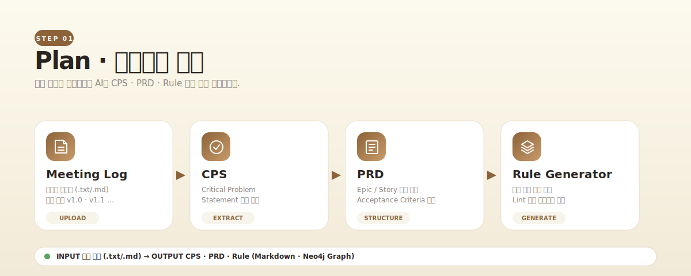

**미팅 로그를 한 번 업로드**하면 4개의 서브 단계가 순차적으로 채워집니다.

- **Meeting Log** — `.txt`/`.md` 업로드, 버전 관리(`v1.0`, `v1.1` …)
- **CPS** (Critical Problem Statement) — 핵심 문제 정의 자동 추출
- **PRD** — Epic / User Story / Acceptance Criteria 자동 분해
- **Rule Generator** — Lint 단계에서 사용할 개발 규칙 도출

> 미팅 로그가 바뀌면 하위 산출물이 모두 재생성됩니다. 버전 단위로 비교 가능합니다.

---

## 🎨 Step 02 · Design — 시스템 설계 자동화

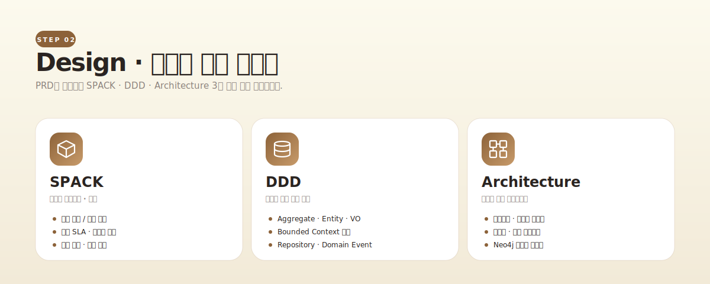

PRD를 입력으로 **3개의 설계 탭이 동시에 채워집니다**.

| Tab | 역할 | 주요 산출물 |
|-----|-----|------------|
| **SPACK** | 비기능 요구사항 · 정책 | 보안 / 성능 SLA / 운영 / 배포 |
| **DDD** | 도메인 모델 추출 | Aggregate · Entity · VO · Bounded Context |
| **Architecture** | 시스템 구조 | 컴포넌트 · 의존성 · 통신 프로토콜 |

> Neo4j 그래프 시각화로 **컴포넌트 간 관계를 한눈에** 파악할 수 있습니다.

---

## 💻 Step 03 · Code — Vibe Coding

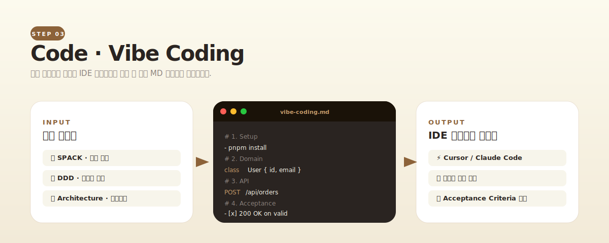

설계 산출물을 그대로 **IDE 에이전트가 읽을 수 있는 Markdown 가이드**로 변환합니다.

- ⚡ **Cursor / Claude Code / Cline** 등 어떤 코딩 에이전트에도 그대로 던질 수 있는 형식
- 📝 단계별 Setup → Domain → API → Acceptance 구조
- ✅ 각 단계마다 검증 가능한 Acceptance Criteria 포함

> Vibe Coding 결과물은 다음 Lint 단계의 검증 대상이 됩니다.

---

## 🔍 Step 04 · Lint — 규칙 준수율 검증

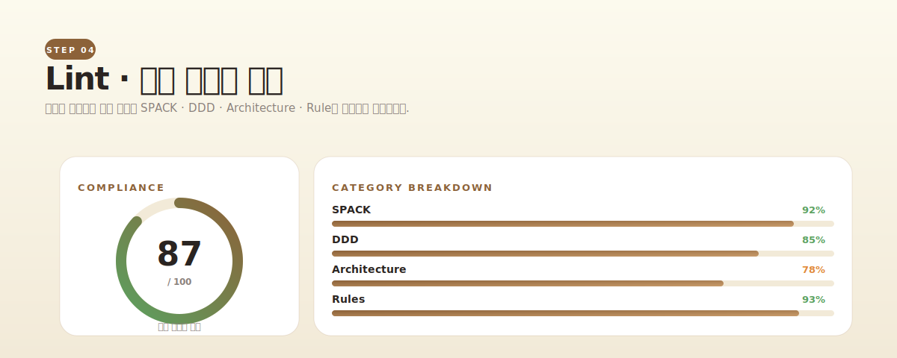

GitHub Repository URL만 입력하면 **AI가 4개 카테고리를 분석**합니다.

- **SPACK** — 비기능 요구사항 준수 여부
- **DDD** — 도메인 경계 / Aggregate 일관성
- **Architecture** — 레이어 / 의존성 위반
- **Rules** — Plan 단계에서 도출한 프로젝트 규칙

> 위반 사례는 **파일 경로 + 라인 번호 + 어떤 규칙 위반인지**를 명시해 리포트로 제공됩니다.

---

## 📦 Step 05 · Deliverables — 산출물 인수인계

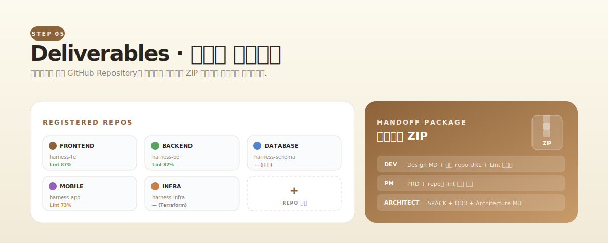

프로젝트의 **모든 GitHub Repository를 역할별로 정리**하고, 대상별 인수인계 ZIP 패키지로 묶어 전달합니다.

- 🌿 **Frontend / Backend / Database / Mobile / Infra / Other** 6개 역할로 자동 분류
- 📥 **인수인계 모드 3가지**:
  - **DEV** — Design MD + 모든 repo URL + 최신 Lint 리포트
  - **PM** — PRD + repo별 Lint 점수 요약
  - **ARCHITECT** — SPACK + DDD + Architecture MD
- Code · Lint 화면에서 입력한 GitHub URL이 자동 등록되며, 여기에서 역할/별칭을 편집할 수 있습니다.

---

## 🧭 사용자 여정

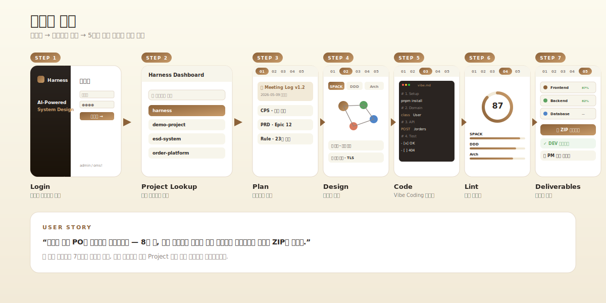

로그인부터 마지막 단계까지 **사용자가 거치는 7개 화면**을 시계열로 펼친 그림입니다. 한 명의 사용자가 같은 Project 노드 아래에서 모든 산출물을 누적한다는 점이 핵심입니다.

---

## 🏗 시스템 아키텍처

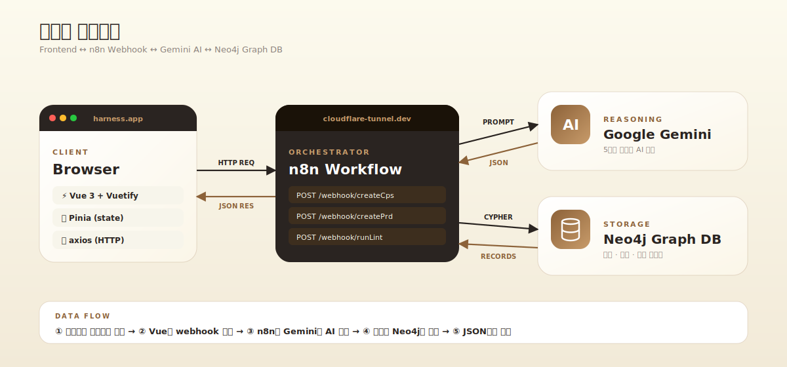

**Frontend(Vue) ↔ n8n Webhook ↔ Gemini AI ↔ Neo4j Graph DB** 4개 컴포넌트의 데이터 흐름입니다. 모든 무거운 작업(AI 분석 · 그래프 쿼리)은 n8n이 오케스트레이션하고, 프론트는 webhook 호출만 담당합니다.

---

## 🕸 데이터 그래프

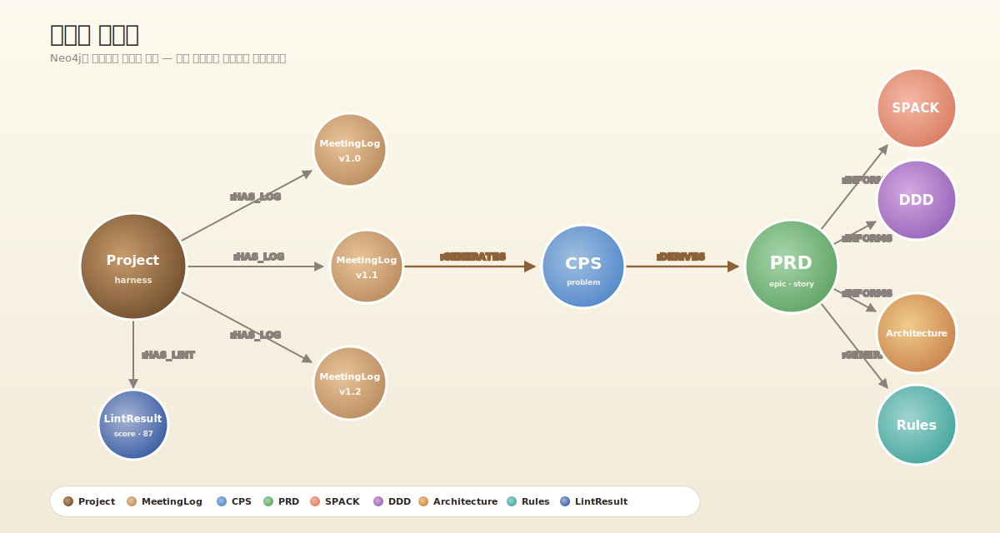

Neo4j에 저장되는 **노드 타입**(Project · MeetingLog · CPS · PRD · SPACK · DDD · Architecture · Rules)과 **관계**(`:HAS_LOG`, `:GENERATES`, `:DERIVES`, `:INFORMS`)를 한눈에 보여줍니다.

핵심 포인트:
- **MeetingLog가 버전별로 누적**(v1.0, v1.1, v1.2 …)되어 회의록 변경 이력 추적
- 모든 산출물이 **Project를 루트**로 연결
- `:GENERATES`(갈색 굵은 화살표)는 직접 생성 관계, `:INFORMS`(회색 화살표)는 영향 관계

---

## 🛠️ Tech Stack

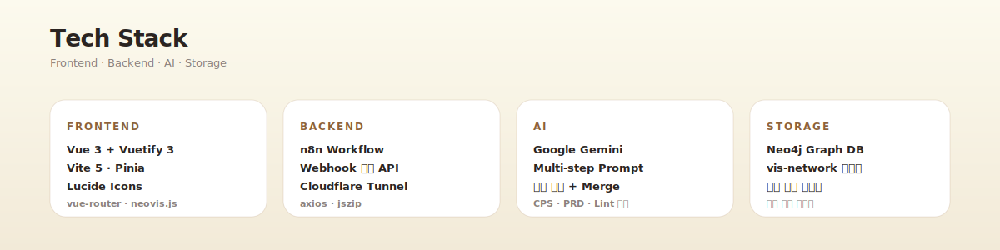

| Layer | Stack |
|-------|-------|
| **Frontend** | Vue 3 · Vuetify 3 · Vite 5 · Pinia · vue-router · Lucide |
| **Backend** | n8n Workflow · Webhook · Cloudflare Tunnel |
| **AI** | Google Gemini (Multi-step / Parallel Merge) |
| **Storage** | Neo4j Graph DB · vis-network · neovis.js |

---

## 🚀 빠른 시작

```bash
# 1. 의존성 설치
pnpm install

# 2. 개발 서버 실행 (Vite)
pnpm dev

# 3. 프로덕션 빌드
pnpm build
```

기본 관리자 계정으로 대시보드에 진입할 수 있습니다.

| Username | Password |
|----------|----------|
| `admin` | `$martdept` |

---

## 📁 프로젝트 구조

```
.
├── docs/images/          # README의 SVG 다이어그램 12장
├── src/
│   ├── pages/            # 라우트 단위 페이지 (자동 라우팅)
│   ├── views/            # 5단계 화면 본체
│   ├── components/
│   │   ├── plan/         # MeetingLog · CPS · PRD · RuleGenerator
│   │   ├── design/       # SPACK · DDD · Architecture
│   │   └── common/       # ProjectLookup
│   ├── store/            # Pinia (harness store)
│   └── utils/            # axios 인스턴스 등
├── 샘플 미팅 로그/        # 데모용 입력 데이터
└── vite.config.js
```

---

<div align="center">

**Harness** — *Meeting → PRD → Design → Code → Lint → Normalized DB*

</div>
